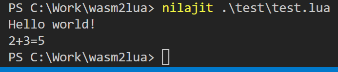

# 🎉 wasm2lua 🎊

 

[](https://travis-ci.com/SwadicalRag/wasm2lua)

Have YOU ever wanted to run C++/C/Rust/javascript/banana/etc. on Lua without using native modules?

GOOD NEWS, fam: `wasm2lua` can compile WebAssembly modules to pure Lua (or with FFI LuaJIT for extra speed). This means that anything that can be compiled to WASM can be compiled to Lua! Long Live John Lua!

## Notes

 - The generated code is heavily dependent upon the LuaJIT bit library
 - Some of `@webassemblyjs`'s libraries are monkey patched at runtime
 - `luamin` is monkey patched at runtime
 - The WASI API is still under heavy development
 - Emscripten is NOT supported out of the box. You will need to compile things via the WASI ecosystem.

# Usage

`wasm2lua <in.wasm> <out.lua>`

`lua-webidl <in.idl> <out.cpp> --cpp`

(Run those commands with `--help` for other options)

See `HOWTO-BINDINGS.md` in this repository for reference on how to use the WebIDL binder.

## Installation

`npm i -g wasm2lua`

# Projects that use `wasm2lua`

 - [bullet3-lua](https://github.com/SwadicalRag/bullet3-lua) ([Releases](https://github.com/SwadicalRag/bullet3-lua/releases/), [Demo](https://github.com/SwadicalRag/bullet3-lua/blob/master/test.lua)), built with CMake
 - [brotli-lua](https://github.com/SwadicalRag/brotli-lua) ([Releases](https://github.com/SwadicalRag/brotli-lua/releases/), [Demo](https://github.com/SwadicalRag/brotli-lua/blob/master/test.lua)), built with CMake
 - [tiny-regex-lua](https://github.com/SwadicalRag/tiny-regex-lua) ([Demo](https://github.com/SwadicalRag/tiny-regex-lua/blob/master/test.lua)), built with a Makefile

### BONUS: duktape via wasm2lua

```c
int main(int argc, char *argv[]) {
	duk_context *ctx = duk_create_heap_default();

	(void) argc; (void) argv;  /* suppress warning */

	duk_push_c_function(ctx, native_print, DUK_VARARGS);
	duk_put_global_string(ctx, "print");
	duk_push_c_function(ctx, native_adder, DUK_VARARGS);
	duk_put_global_string(ctx, "adder");

	duk_eval_string(ctx, "print('Hello world!');");

	duk_eval_string(ctx, "print('2+3=' + adder(2, 3));");
	duk_pop(ctx);  /* pop eval result */

	duk_destroy_heap(ctx);

	return 0;
}

```


